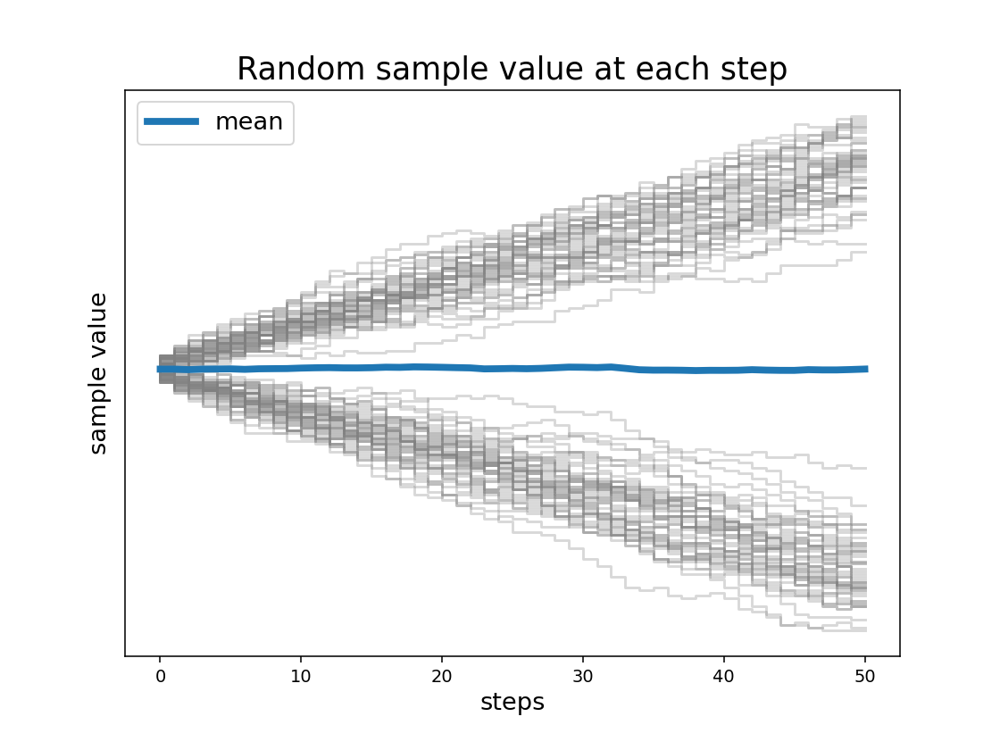

# illustration of how the average can hide diverging samples

- The algorithm here starts with a "seed" value of either -1 or 1. At each step/iteration, it adds the seed value to itself.  
- Note that the added value is multiplied by a value between -1 to 5 so that there is some variation between each addition.  
- The effect is that a value that starts at 1 will almost always increase in *positive* value with each step, while a value that starts at -1 will almost always increase in *negative* value with each step. Since there is roughly equal proportions of -1 and 1 the effect is to create two diverging sets of samples heading towards positive and negative infinity with increasing steps.  
- But we can take the mean value of all samples at each step and we find that the mean value stays close to zero! Here we see how the mean does not summarise our data in a useful way.

